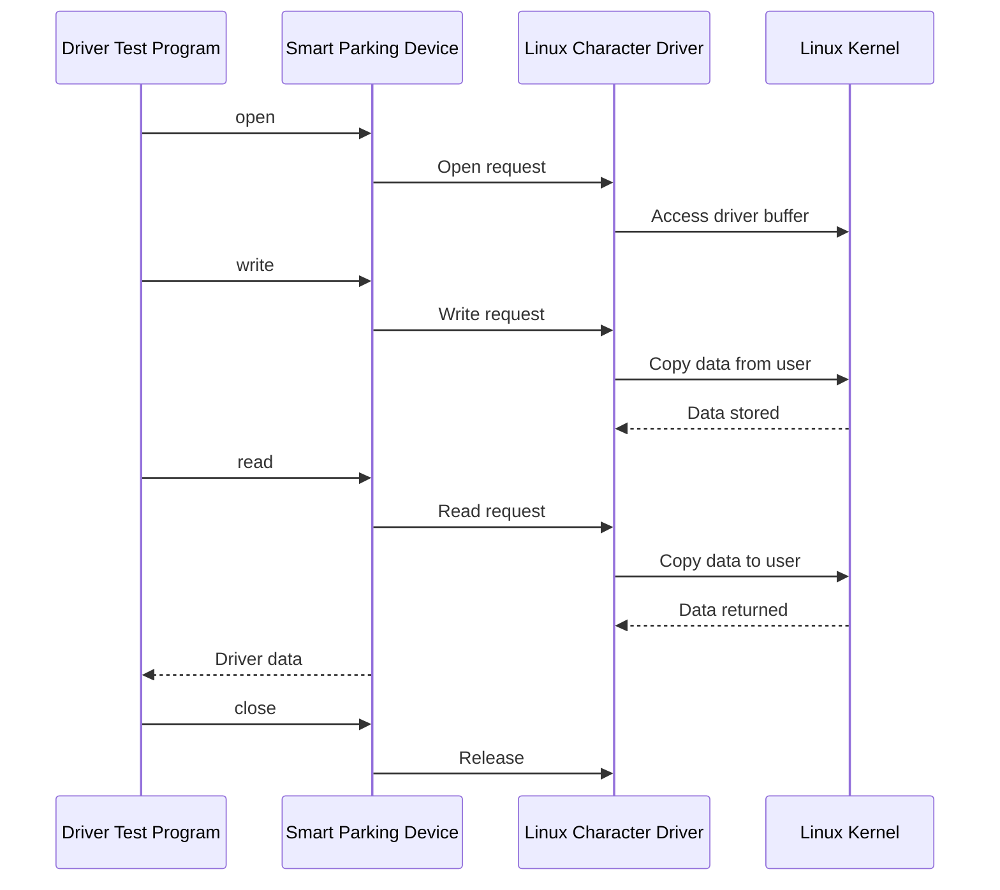
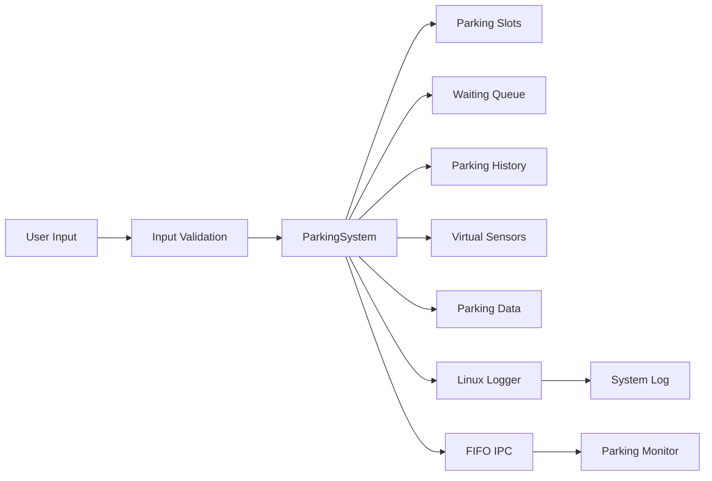
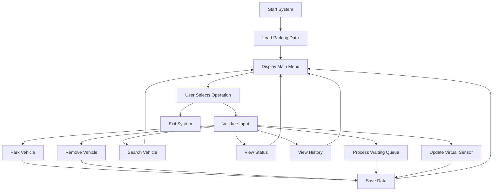
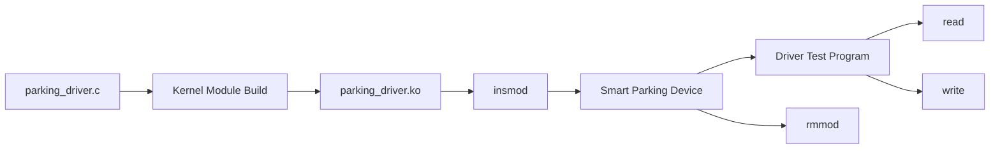

**# UML Diagrams — Linux-Based Smart Parking Management System**


This document presents the UML and system architecture diagrams for the Linux-Based Smart Parking Management System.


The diagrams describe the system actors, classes, components, communication flows, data flow, and Linux kernel interaction.


\--


**# 1. Use Case Diagram**


The Use Case Diagram represents the major operations performed by the parking system user and system administrator.


```mermaid


flowchart LR


USER["Parking System User"]


ADMIN["System Administrator"]


PARK["Park Vehicle"]


REMOVE["Remove Vehicle"]


SEARCH["Search Vehicle"]


STATUS["View Parking Status"]


HISTORY["View Parking History"]


QUEUE["Manage Waiting Queue"]


SENSOR["Use Virtual Sensors"]


IPC["Send IPC Status"]


SAVE["Save Parking Data"]


LOAD["Load Parking Data"]


LOG["View System Logs"]


DRIVER["Manage Linux Driver"]


DEVICE["Test Device Communication"]


MONITOR["Monitor IPC Messages"]


USER --> PARK


USER --> REMOVE


USER --> SEARCH


USER --> STATUS


USER --> HISTORY


USER --> QUEUE


USER --> SENSOR


USER --> IPC


ADMIN --> SAVE


ADMIN --> LOAD


ADMIN --> LOG


ADMIN --> DRIVER


ADMIN --> DEVICE


ADMIN --> MONITOR


**### Main Use Cases**


&#x20;Actor | Use Case | Description |


\---|---|---|


&#x20;User | Park Vehicle | Parks a vehicle in a compatible available slot |


&#x20;User | Remove Vehicle | Removes a vehicle from its parking slot |


&#x20;User | Search Vehicle | Searches for a vehicle in the system |


&#x20;User | View Parking Status | Displays occupied and available slots |


&#x20;User | View Parking History | Displays previous parking records |


&#x20;User | Manage Waiting Queue | Maintains vehicles waiting for available slots |


&#x20;User | Use Virtual Sensors | Simulates parking slot occupancy |


&#x20;User | Send IPC Status | Sends system status through FIFO IPC |


&#x20;Administrator | Save Parking Data | Saves parking information to persistent storage |


&#x20;Administrator | Load Parking Data | Loads previously saved parking information |


&#x20;Administrator | View System Logs | Reviews Linux system activity logs |


&#x20;Administrator | Manage Linux Driver | Builds, loads and unloads the kernel driver |


&#x20;Administrator | Test Device Communication | Tests the character device |


&#x20;Administrator | Monitor IPC Messages | Receives messages from the parking application |


```
\--


**# 2. Class Diagram**


The Class Diagram represents the major C++ classes and their relationships.


```mermaid


classDiagram


class Vehicle {


&#x20;   string number


&#x20;   string owner


&#x20;   string type


}


class ParkingSlot {


&#x20;   int slotNumber


&#x20;   string slotType


&#x20;   bool occupied


&#x20;   parkVehicle()


&#x20;   removeVehicle()


&#x20;   isAvailable()


}


class HistoryNode {


&#x20;   Vehicle vehicle


&#x20;   int slotNumber


&#x20;   HistoryNode next


}


class ParkingSystem {


&#x20;   vector slots


&#x20;   queue waitingQueue


&#x20;   HistoryNode historyHead


&#x20;   parkVehicle()


&#x20;   removeVehicle()


&#x20;   searchVehicle()


&#x20;   displayStatus()


&#x20;   displayHistory()


&#x20;   saveData()


&#x20;   loadData()


&#x20;   processWaitingQueue()


}


class ParkingSensor {


&#x20;   int sensorId


&#x20;   int slotNumber


&#x20;   bool occupied


&#x20;   detectVehicle()


&#x20;   clearVehicle()


&#x20;   toggle()


&#x20;   setOccupied()


&#x20;   getStatus()


&#x20;   displaySensor()


}


class ParkingIPC {


&#x20;   string fifoPath


&#x20;   createFIFO()


&#x20;   sendStatus()


&#x20;   receiveStatus()


}


class LinuxLogger {


&#x20;   string logFile


&#x20;   logInfo()


&#x20;   logError()


&#x20;   writeLog()


}


class DriverTest {


&#x20;   openDevice()


&#x20;   writeToDriver()


&#x20;   readFromDriver()


&#x20;   closeDevice()


}


ParkingSystem --> ParkingSlot


ParkingSystem --> Vehicle


ParkingSystem --> HistoryNode


ParkingSystem --> ParkingSensor


ParkingSystem --> ParkingIPC


ParkingSystem --> LinuxLogger


DriverTest --> ParkingIPC


ParkingSlot --> Vehicle


HistoryNode --> HistoryNode


**## Class Responsibilities**


**### Vehicle**


Stores vehicle information:


&#x20;Vehicle number


&#x20;Owner name


&#x20;Vehicle type


**### ParkingSlot**


Represents an individual parking slot.


The system contains:


&#x20;Slots 1 to 3 for cars


&#x20;Slots 4 to 5 for bikes


**### ParkingSystem**


The main C++ class responsible for:


&#x20;Parking vehicles


&#x20;Removing vehicles


&#x20;Searching vehicles


&#x20;Managing slots


&#x20;Managing the waiting queue


&#x20;Maintaining parking history


&#x20;Saving data


&#x20;Loading data


**### HistoryNode**


Represents a node in the linked-list based parking history.


**### ParkingSensor**


Provides virtual parking sensor functionality.


**### ParkingIPC**


Implements FIFO-based inter-process communication.


**### LinuxLogger**


Provides Linux file-descriptor based logging.


**### DriverTest**


Tests communication with the Linux character device.


```
\--


**# 3. Component and System Architecture**


The following diagram represents the overall system architecture.


```mermaid


flowchart TB


USER["User"]


MAIN["Smart Parking Application"]


SYSTEM["ParkingSystem"]


SLOTS["Parking Slots"]


VEHICLE["Vehicle Management"]


QUEUE["Waiting Queue"]


HISTORY["Parking History"]


SENSOR["Virtual Parking Sensors"]


LOGGER["Linux Logger"]


IPCMODULE["Parking IPC"]


MONITOR["Parking Monitor"]


TEST["Driver Test Program"]


DATA["parking_data.txt"]


LOGFILE["parking.log"]


FIFO["smart parking FIFO"]


DEVICE["smart parking Device"]


DRIVER["Linux Character Driver"]


KERNEL["Linux Kernel"]


USER --> MAIN


MAIN --> SYSTEM


SYSTEM --> SLOTS


SYSTEM --> VEHICLE


SYSTEM --> QUEUE


SYSTEM --> HISTORY


SYSTEM --> SENSOR


SYSTEM --> LOGGER


SYSTEM --> IPCMODULE


SYSTEM --> DATA


LOGGER --> LOGFILE


IPCMODULE --> FIFO


FIFO --> MONITOR


TEST --> DEVICE


DEVICE --> DRIVER


DRIVER --> KERNEL


**## Architecture Layers**


**### User Space**


The user-space layer contains the main C++ application and supporting programs.


text


main.cpp


parking_system.cpp


parking_sensor.cpp


parking_ipc.cpp


linux_logger.cpp


parking_monitor.cpp


parking_driver_test.cpp


**### Persistent Storage**


The project uses files for persistent storage and logging.


text


parking_data.txt


parking.log


**### IPC Layer**


The main application communicates with the separate monitoring process using a Linux named FIFO.


text


/tmp/smart_parking_fifo


**### Kernel Space**


The Linux character device driver provides the kernel-level device interface.


text


parking_driver.ko


&#x20;   |


&#x20;   v


/dev/smart_parking


```
\--


**# 4. Vehicle Parking Sequence Diagram**


This sequence shows the major operations performed when a vehicle is parked.

```mermaid



sequenceDiagram



actor User



participant Main as Main Application



participant System as ParkingSystem



participant Slot as ParkingSlot



participant Sensor as ParkingSensor



participant Logger as LinuxLogger



participant Data as Parking Data







User->>Main: Select Park Vehicle



Main->>System: parkVehicle



System->>System: Validate vehicle



System->>Slot: Find compatible slot







alt Slot available



&#x20;   Slot-->>System: Available slot



&#x20;   System->>Slot: Park vehicle



&#x20;   System->>Sensor: Set occupied



&#x20;   Sensor-->>System: Occupied



&#x20;   System->>Logger: Log parking event



&#x20;   System->>Data: Save parking data



&#x20;   System-->>Main: Parking successful



&#x20;   Main-->>User: Display assigned slot



else No slot available



&#x20;   System->>System: Add vehicle to queue



&#x20;   System->>Logger: Log queue event



&#x20;   System-->>Main: Vehicle queued



&#x20;   Main-->>User: Display queue message



end











```



\--


**# 5. Vehicle Removal Sequence Diagram**


This sequence represents vehicle removal and waiting queue processing.


```mermaid


sequenceDiagram


actor User


participant Main as Main Application


participant System as ParkingSystem


participant Slot as ParkingSlot


participant Sensor as ParkingSensor


participant Queue as Waiting Queue


participant Logger as LinuxLogger


participant Data as Parking Data


User->>Main: Select Remove Vehicle


Main->>System: removeVehicle


System->>Slot: Search vehicle


alt Vehicle found


&#x20;   Slot-->>System: Vehicle found


&#x20;   System->>Slot: Remove vehicle


&#x20;   System->>Sensor: Clear sensor


&#x20;   Sensor-->>System: Slot free


&#x20;   System->>System: Add record to history


&#x20;   System->>Queue: Check waiting queue


&#x20;   alt Waiting vehicle exists


&#x20;       Queue-->>System: Waiting vehicle


&#x20;       System->>Slot: Assign available slot


&#x20;       System->>Sensor: Set occupied


&#x20;       System->>Logger: Log automatic allocation


&#x20;   else Queue empty


&#x20;       System->>System: Keep slot available


&#x20;   end


&#x20;   System->>Logger: Log removal


&#x20;   System->>Data: Save updated data


&#x20;   System-->>Main: Removal successful


&#x20;   Main-->>User: Display updated status


else Vehicle not found


&#x20;   System-->>Main: Vehicle not found


&#x20;   Main-->>User: Display error


end


```
\--


**# 6. FIFO IPC Sequence Diagram**


This sequence represents communication between the main parking application and the monitoring process.


```mermaid


sequenceDiagram


participant Main as Smart Parking Application


participant IPC as ParkingIPC


participant FIFO as Linux FIFO


participant Monitor as Parking Monitor


Monitor->>FIFO: Open FIFO for reading


Main->>IPC: Send parking status


IPC->>FIFO: Write status message


FIFO-->>Monitor: Status message


Monitor->>Monitor: Display message


Example message:


text


SMART PARKING STATUS


Total Slots=5


Occupied=0


Free=5


Waiting=0


```
\--


**# 7. Linux Character Device Driver Sequence Diagram**


This sequence represents communication between the user-space driver test program and the Linux kernel driver.



\--


**# 8. System Data Flow**


The following diagram represents the overall data flow.



\--


**# 9. Linux Kernel Interaction**


The project demonstrates communication between user space and kernel space using a Linux character device driver.


```mermaid


flowchart TB


APP["User Space Application"]


TEST["Driver Test Program"]


DEVICE["Smart Parking Device"]


DRIVER["Linux Character Driver"]


KERNEL["Linux Kernel"]


SYSTEM["Linux System"]


APP --> TEST


TEST --> DEVICE


DEVICE --> DRIVER


DRIVER --> KERNEL


KERNEL --> SYSTEM


The character driver provides:


&#x20;Character device registration


&#x20;Major and minor device numbers


&#x20;Open operation


&#x20;Read operation


&#x20;Write operation


&#x20;Release operation


&#x20;Kernel logging


&#x20;User-space and kernel-space data transfer


&#x20;Mutex protection


The device is exposed to user space as:


text


/dev/smart_parking


The kernel module is:


text


parking_driver.ko


```
\--


**# 10. Overall System Workflow**



\--


**# 11. Linux Device Driver Workflow**



\--


\*\*# 12. IOCTL Device-Control Design


The Linux character-device driver provides an ioctl interface defined in:


kernel_driver/parking_ioctl.h


The supported commands are:


IOCTL Command


Purpose


SMART_PARKING_IOCTL_GET_BUFFER_SIZE


Returns the current device-buffer size


SMART_PARKING_IOCTL_CLEAR_BUFFER


Clears the device buffer and resets its size


The driver test program verifies both commands after performing a device write and read operation.


The final IOCTL test result was:


Buffer size: 36 bytes

Buffer size after clear: 0 bytes

IOCTL TEST SUCCESSFUL


14\. Automated Testing Architecture


The project includes a dedicated automated C++ test suite for validating core parking functionality.


Test file:


tests/test_parking_system.cpp


The automated suite covers:


Vehicle parking.


Vehicle removal.


Waiting queue behavior.


Automatic waiting-queue allocation.


Data persistence.


Virtual parking sensor behavior.


Invalid vehicle validation.


Final result:


Passed : 7

Failed : 0

ALL TESTS PASSED


The automated tests validate the application layer independently from the kernel-driver test application.


13\. Project Data Structures\*\*


The project uses multiple data structures.


&#x20;Data Structure | Usage |


\---|---|


&#x20;Vector | Stores parking slots |


&#x20;Queue | Stores vehicles waiting for parking |


&#x20;Linked List | Stores parking history |


&#x20;Smart Pointer | Manages dynamic vehicle objects |


&#x20;Strings | Stores vehicle and owner information |


**### Vector**


Parking slots are maintained using a C++ vector.


text


ParkingSystem


&#x20; |


&#x20; +---- Slot 1


&#x20; +---- Slot 2


&#x20; +---- Slot 3


&#x20; +---- Slot 4


&#x20; +---- Slot 5


**### Queue**


Vehicles that cannot immediately be parked are placed into the waiting queue.


text


Front


&#x20; |


&#x20; v


Vehicle A -> Vehicle B -> Vehicle C


&#x20;                         |


&#x20;                        Rear


**### Linked List**


Parking history is maintained using linked-list nodes.


text


History Head


&#x20;|


&#x20;v


+---------+     +---------+     +---------+


&#x20;Vehicle | --> | Vehicle | --> | Vehicle |


+---------+     +---------+     +---------+


\--


**# 14. Linux User Space and Kernel Space**


```mermaid


flowchart TB


subgraph USERSPACE["USER SPACE"]


&#x20;   APP["Smart Parking Application"]


&#x20;   DRIVERTEST["Driver Test Program"]


&#x20;   MONITOR["Parking Monitor"]


end


subgraph KERNELSPACE["KERNEL SPACE"]


&#x20;   DRIVER["Linux Character Driver"]


&#x20;   KERNEL["Linux Kernel"]


end


APP --> DRIVERTEST


DRIVERTEST --> DRIVER


DRIVER --> KERNEL


APP --> MONITOR


The architecture separates normal application execution from privileged kernel-level driver execution.


```
\--


**# 15. Training Concepts Demonstrated**


The project demonstrates the following training concepts.


**## C++**


&#x20;Classes and objects


&#x20;Encapsulation


&#x20;STL containers


&#x20;Vector


&#x20;Queue


&#x20;Smart pointers


&#x20;Linked lists


&#x20;File handling


&#x20;Exception handling


&#x20;Modular programming


**## Linux System Programming**


&#x20;Linux file descriptors


&#x20;File operations


&#x20;open


&#x20;read


&#x20;write


&#x20;close


&#x20;FIFO IPC


&#x20;Process communication


&#x20;Linux logging


&#x20;User space and kernel space


**## Linux Device Drivers**


&#x20;Kernel modules


&#x20;Character devices


&#x20;Major and minor numbers


&#x20;Device files


&#x20;cdev


&#x20;open


&#x20;read


&#x20;write


&#x20;release


&#x20;copy_to_user


&#x20;copy_from_user


&#x20;Mutex protection


&#x20;insmod


&#x20;rmmod


&#x20;lsmod


**## Data Structures**


&#x20;Vector


&#x20;Queue


&#x20;Linked list


&#x20;Searching


&#x20;Dynamic memory


&#x20;Smart pointers


**## Operating Systems and Computer Architecture**


&#x20;User space


&#x20;Kernel space


&#x20;System calls


&#x20;File descriptors


&#x20;Memory protection


&#x20;Device abstraction


&#x20;Kernel interface


\--


**# 16. UML and Architecture Summary**


&#x20;Diagram | Purpose |


\---|---|


&#x20;Use Case Diagram | Shows system actors and operations |


&#x20;Class Diagram | Shows C++ classes and relationships |


&#x20;Component Architecture | Shows system components and layers |


&#x20;Parking Sequence | Shows vehicle parking workflow |


&#x20;Removal Sequence | Shows vehicle removal workflow |


&#x20;FIFO IPC Sequence | Shows inter-process communication |


&#x20;Driver Sequence | Shows user-space and kernel communication |


&#x20;Data Flow | Shows system information flow |


&#x20;Kernel Interaction | Shows Linux driver architecture |


&#x20;Overall Workflow | Shows application execution flow |


&#x20;Driver Workflow | Shows driver build and execution |


&#x20;Data Structure Diagram | Shows vector, queue and linked list usage |


&#x20;User/Kernel Diagram | Shows Linux privilege separation |


\--


**# 17. Conclusion**


The Linux-Based Smart Parking Management System integrates application-level programming with Linux system programming and kernel-level device-driver concepts.


The overall architecture can be summarized as:


text


C++ Application


&#x20;  |


&#x20;  +-- Object-Oriented Programming


&#x20;  |


&#x20;  +-- STL Data Structures


&#x20;  |


&#x20;  +-- File Handling


&#x20;  |


&#x20;  +-- Virtual Parking Sensors


&#x20;  |


&#x20;  +-- Linux Logging


&#x20;  |


&#x20;  +-- FIFO IPC


&#x20;  |


&#x20;  +-- Driver Test Program


&#x20;  |


&#x20;  +-- /dev/smart_parking


&#x20;  |


&#x20;  +-- Linux Character Device Driver


&#x20;  |


&#x20;  +-- Linux Kernel


The UML diagrams provide a complete design representation of the project's functional behavior, software structure, communication mechanisms, data flow, and Linux kernel interaction.
