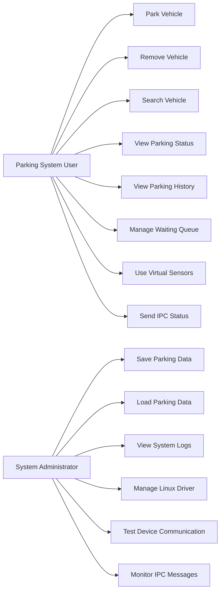
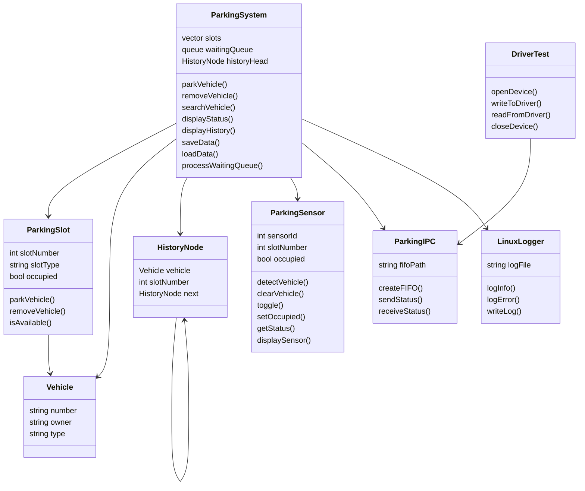
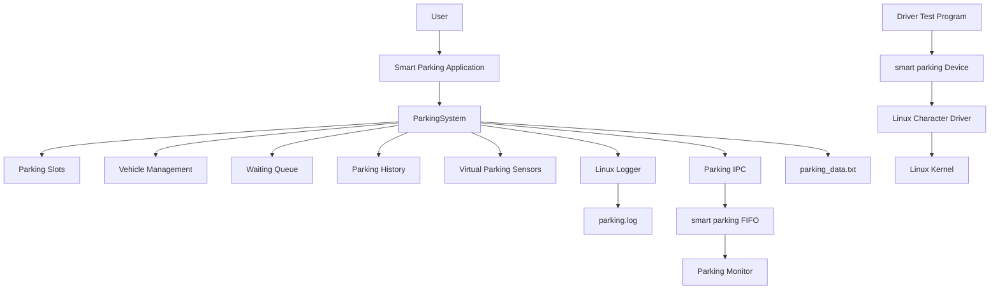
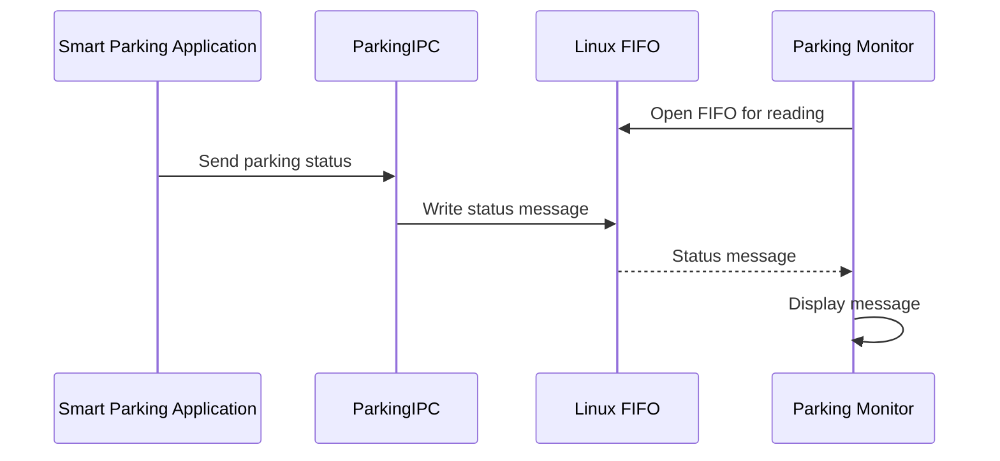
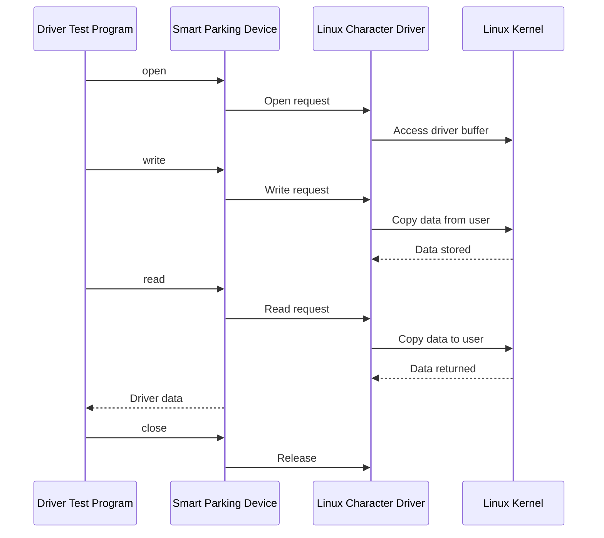
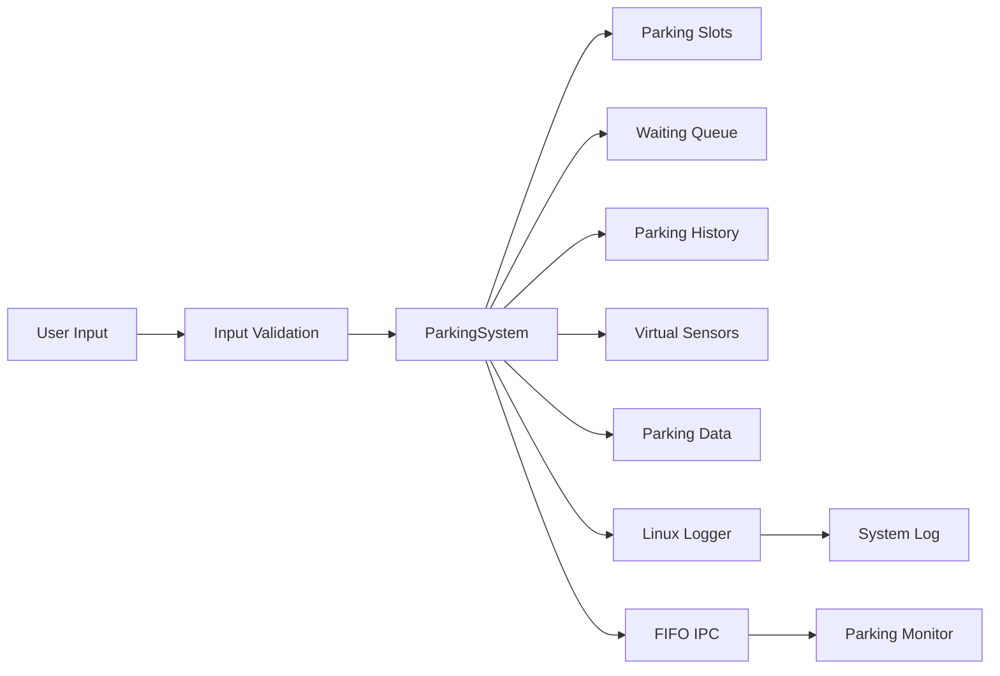
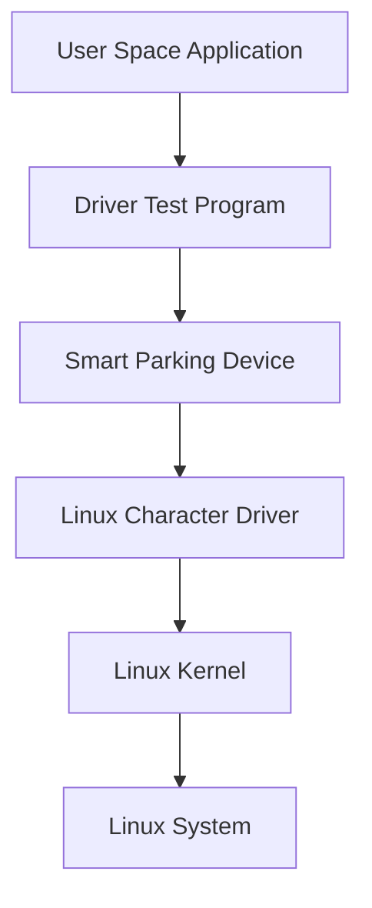
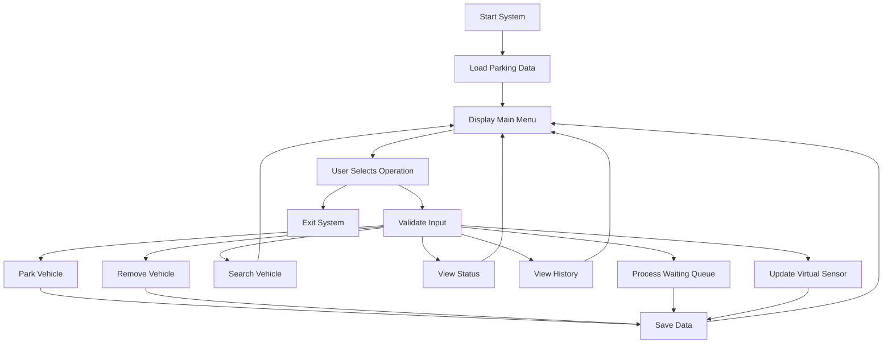
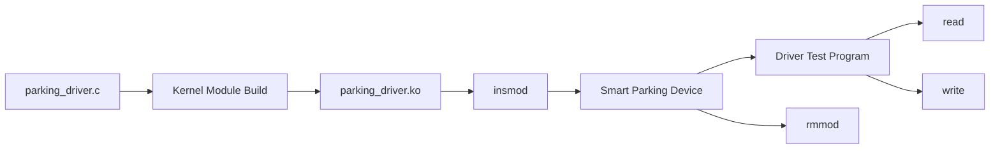
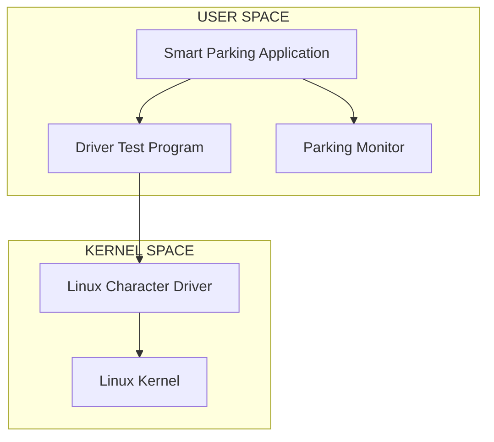

# UML Diagrams — Linux-Based Smart Parking Management System

This document presents the UML and system architecture diagrams for the Linux-Based Smart Parking Management System.

The diagrams describe the system actors, classes, components, communication flows, data flow, and Linux kernel interaction.

--

# 1. Use Case Diagram

The Use Case Diagram represents the major operations performed by the parking system user and system administrator.



### Main Use Cases

 Actor | Use Case | Description |

---|---|---|

 User | Park Vehicle | Parks a vehicle in a compatible available slot |

 User | Remove Vehicle | Removes a vehicle from its parking slot |

 User | Search Vehicle | Searches for a vehicle in the system |

 User | View Parking Status | Displays occupied and available slots |

 User | View Parking History | Displays previous parking records |

 User | Manage Waiting Queue | Maintains vehicles waiting for available slots |

 User | Use Virtual Sensors | Simulates parking slot occupancy |

 User | Send IPC Status | Sends system status through FIFO IPC |

 Administrator | Save Parking Data | Saves parking information to persistent storage |

 Administrator | Load Parking Data | Loads previously saved parking information |

 Administrator | View System Logs | Reviews Linux system activity logs |

 Administrator | Manage Linux Driver | Builds, loads and unloads the kernel driver |

 Administrator | Test Device Communication | Tests the character device |

 Administrator | Monitor IPC Messages | Receives messages from the parking application |


# 2. Class Diagram

The Class Diagram represents the major C++ classes and their relationships.



## Class Responsibilities

### Vehicle

Stores vehicle information:

 Vehicle number

 Owner name

 Vehicle type

### ParkingSlot

Represents an individual parking slot.

The system contains:

 Slots 1 to 3 for cars

 Slots 4 to 5 for bikes

### ParkingSystem

The main C++ class responsible for:

 Parking vehicles

 Removing vehicles

 Searching vehicles

 Managing slots

 Managing the waiting queue

 Maintaining parking history

 Saving data

 Loading data

### HistoryNode

Represents a node in the linked-list based parking history.

### ParkingSensor

Provides virtual parking sensor functionality.

### ParkingIPC

Implements FIFO-based inter-process communication.

### LinuxLogger

Provides Linux file-descriptor based logging.

### DriverTest

Tests communication with the Linux character device.


# 3. Component and System Architecture

The following diagram represents the overall system architecture.



## Architecture Layers

### User Space

The user-space layer contains the main C++ application and supporting programs.

text

main.cpp

parking_system.cpp

parking_sensor.cpp

parking_ipc.cpp

linux_logger.cpp

parking_monitor.cpp

parking_driver_test.cpp


### Persistent Storage

The project uses files for persistent storage and logging.

text

parking_data.txt

parking.log


### IPC Layer

The main application communicates with the separate monitoring process using a Linux named FIFO.

text

/tmp/smart_parking_fifo


### Kernel Space

The Linux character device driver provides the kernel-level device interface.

text

parking_driver.ko

    |

    v

/dev/smart_parking


# 4. Vehicle Parking Sequence Diagram

This sequence shows the major operations performed when a vehicle is parked.

```mermaid
sequenceDiagram

actor User

participant Main as Main Application

participant System as ParkingSystem

participant Slot as ParkingSlot

participant Sensor as ParkingSensor

participant Logger as LinuxLogger

participant Data as Parking Data


User->>Main: Select Park Vehicle

Main->>System: parkVehicle

System->>System: Validate vehicle

System->>Slot: Find compatible slot


alt Slot available

    Slot-->>System: Available slot

    System->>Slot: Park vehicle

    System->>Sensor: Set occupied

    Sensor-->>System: Occupied

    System->>Logger: Log parking event

    System->>Data: Save parking data

    System-->>Main: Parking successful

    Main-->>User: Display assigned slot
```

else No slot available

    System->>System: Add vehicle to queue

    System->>Logger: Log queue event

    System-->>Main: Vehicle queued

    Main-->>User: Display queue message

end


# 5. Vehicle Removal Sequence Diagram

This sequence represents vehicle removal and waiting queue processing.

```mermaid
sequenceDiagram

actor User

participant Main as Main Application

participant System as ParkingSystem

participant Slot as ParkingSlot

participant Sensor as ParkingSensor

participant Queue as Waiting Queue

participant Logger as LinuxLogger

participant Data as Parking Data


User->>Main: Select Remove Vehicle

Main->>System: removeVehicle

System->>Slot: Search vehicle


alt Vehicle found

    Slot-->>System: Vehicle found

    System->>Slot: Remove vehicle

    System->>Sensor: Clear sensor

    Sensor-->>System: Slot free

    System->>System: Add record to history

    System->>Queue: Check waiting queue


    alt Waiting vehicle exists

        Queue-->>System: Waiting vehicle

        System->>Slot: Assign available slot

        System->>Sensor: Set occupied

        System->>Logger: Log automatic allocation

    else Queue empty

        System->>System: Keep slot available

    end


    System->>Logger: Log removal

    System->>Data: Save updated data

    System-->>Main: Removal successful

    Main-->>User: Display updated status
```

else Vehicle not found

    System-->>Main: Vehicle not found

    Main-->>User: Display error

end


# 6. FIFO IPC Sequence Diagram

This sequence represents communication between the main parking application and the monitoring process.



Example message:

text

SMART PARKING STATUS

Total Slots=5

Occupied=0

Free=5

Waiting=0


# 7. Linux Character Device Driver Sequence Diagram

This sequence represents communication between the user-space driver test program and the Linux kernel driver.




# 8. System Data Flow

The following diagram represents the overall data flow.




# 9. Linux Kernel Interaction

The project demonstrates communication between user space and kernel space using a Linux character device driver.



The character driver provides:

 Character device registration

 Major and minor device numbers

 Open operation

 Read operation

 Write operation

 Release operation

 Kernel logging

 User-space and kernel-space data transfer

 Mutex protection

The device is exposed to user space as:

text

/dev/smart_parking


The kernel module is:

text

parking_driver.ko


# 10. Overall System Workflow




# 11. Linux Device Driver Workflow




**# 12. IOCTL Device-Control Design

The Linux character-device driver provides an ioctl interface defined in:

kernel_driver/parking_ioctl.h

The supported commands are:


IOCTL Command


Purpose


SMART_PARKING_IOCTL_GET_BUFFER_SIZE


Returns the current device-buffer size


SMART_PARKING_IOCTL_CLEAR_BUFFER


Clears the device buffer and resets its size

The driver test program verifies both commands after performing a device write and read operation.

The final IOCTL test result was:

Buffer size: 36 bytes
Buffer size after clear: 0 bytes
IOCTL TEST SUCCESSFUL


14. Automated Testing Architecture

The project includes a dedicated automated C++ test suite for validating core parking functionality.

Test file:

tests/test_parking_system.cpp

The automated suite covers:


Vehicle parking.


Vehicle removal.


Waiting queue behavior.


Automatic waiting-queue allocation.


Data persistence.


Virtual parking sensor behavior.


Invalid vehicle validation.

Final result:

Passed : 7
Failed : 0
ALL TESTS PASSED

The automated tests validate the application layer independently from the kernel-driver test application.


13. Project Data Structures**

The project uses multiple data structures.

 Data Structure | Usage |

---|---|

 Vector | Stores parking slots |

 Queue | Stores vehicles waiting for parking |

 Linked List | Stores parking history |

 Smart Pointer | Manages dynamic vehicle objects |

 Strings | Stores vehicle and owner information |

### Vector

Parking slots are maintained using a C++ vector.

text

ParkingSystem

  |

  +---- Slot 1

  +---- Slot 2

  +---- Slot 3

  +---- Slot 4

  +---- Slot 5


### Queue

Vehicles that cannot immediately be parked are placed into the waiting queue.

text

Front

  |

  v

Vehicle A -> Vehicle B -> Vehicle C

                          |

                         Rear


### Linked List

Parking history is maintained using linked-list nodes.

text

History Head

 |

 v

+---------+     +---------+     +---------+

 Vehicle | --> | Vehicle | --> | Vehicle |

+---------+     +---------+     +---------+


--

# 14. Linux User Space and Kernel Space



The architecture separates normal application execution from privileged kernel-level driver execution.


# 15. Training Concepts Demonstrated

The project demonstrates the following training concepts.

## C++

 Classes and objects

 Encapsulation

 STL containers

 Vector

 Queue

 Smart pointers

 Linked lists

 File handling

 Exception handling

 Modular programming

## Linux System Programming

 Linux file descriptors

 File operations

 open

 read

 write

 close

 FIFO IPC

 Process communication

 Linux logging

 User space and kernel space

## Linux Device Drivers

 Kernel modules

 Character devices

 Major and minor numbers

 Device files

 cdev

 open

 read

 write

 release

 copy_to_user

 copy_from_user

 Mutex protection

 insmod

 rmmod

 lsmod

## Data Structures

 Vector

 Queue

 Linked list

 Searching

 Dynamic memory

 Smart pointers

## Operating Systems and Computer Architecture

 User space

 Kernel space

 System calls

 File descriptors

 Memory protection

 Device abstraction

 Kernel interface

--

# 16. UML and Architecture Summary

 Diagram | Purpose |

---|---|

 Use Case Diagram | Shows system actors and operations |

 Class Diagram | Shows C++ classes and relationships |

 Component Architecture | Shows system components and layers |

 Parking Sequence | Shows vehicle parking workflow |

 Removal Sequence | Shows vehicle removal workflow |

 FIFO IPC Sequence | Shows inter-process communication |

 Driver Sequence | Shows user-space and kernel communication |

 Data Flow | Shows system information flow |

 Kernel Interaction | Shows Linux driver architecture |

 Overall Workflow | Shows application execution flow |

 Driver Workflow | Shows driver build and execution |

 Data Structure Diagram | Shows vector, queue and linked list usage |

 User/Kernel Diagram | Shows Linux privilege separation |

--

# 17. Conclusion

The Linux-Based Smart Parking Management System integrates application-level programming with Linux system programming and kernel-level device-driver concepts.

The overall architecture can be summarized as:

text

C++ Application

   |

   +-- Object-Oriented Programming

   |

   +-- STL Data Structures

   |

   +-- File Handling

   |

   +-- Virtual Parking Sensors

   |

   +-- Linux Logging

   |

   +-- FIFO IPC

   |

   +-- Driver Test Program

   |

   +-- /dev/smart_parking

   |

   +-- Linux Character Device Driver

   |

   +-- Linux Kernel


The UML diagrams provide a complete design representation of the project's functional behavior, software structure, communication mechanisms, data flow, and Linux kernel interaction.
